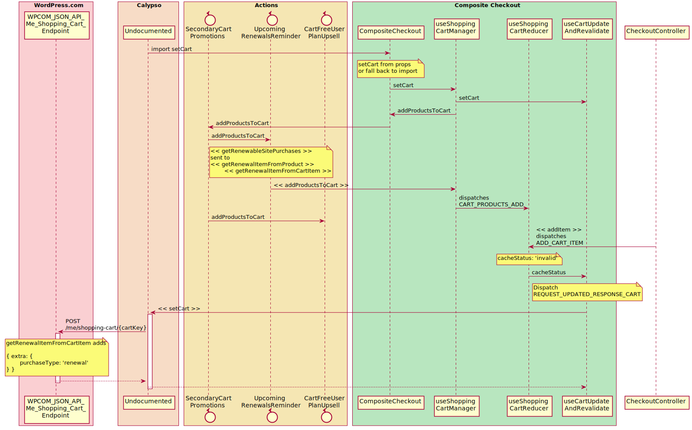
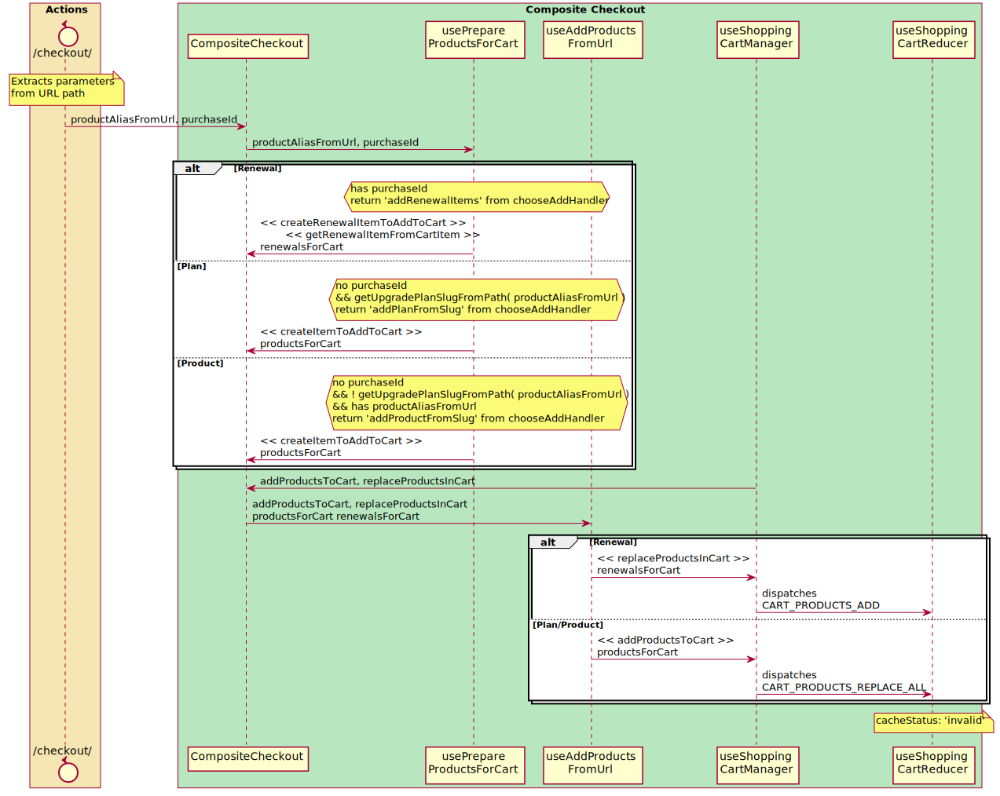
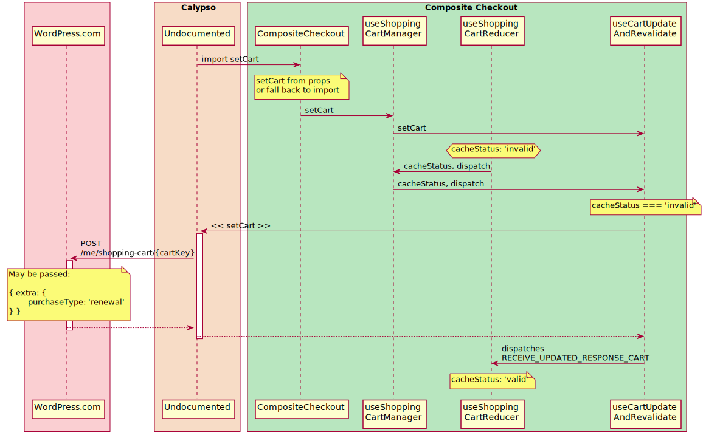

# Shopping Cart

A significant amount of the shopping cart workflow takes place through hooks in Composite Checkout.

## Display Cart 

## Add to Cart

When on a shopping cart page, renewals may be added to the cart by directly modifying the store.

Outside of the shopping cart, items are added through the controller with item details extracted from the URL path.

## Save Cart

